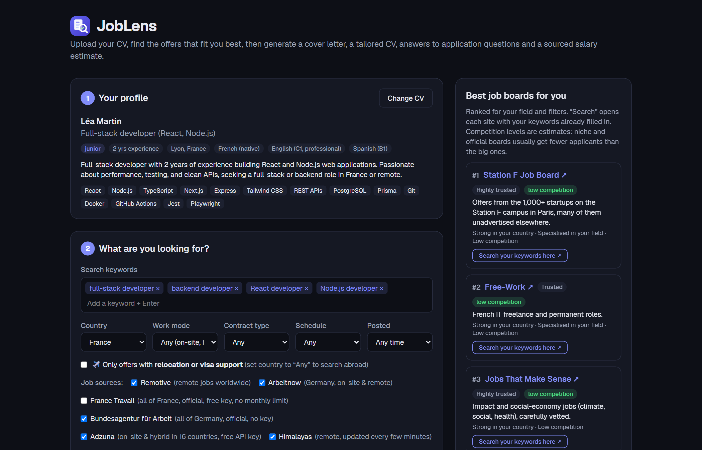
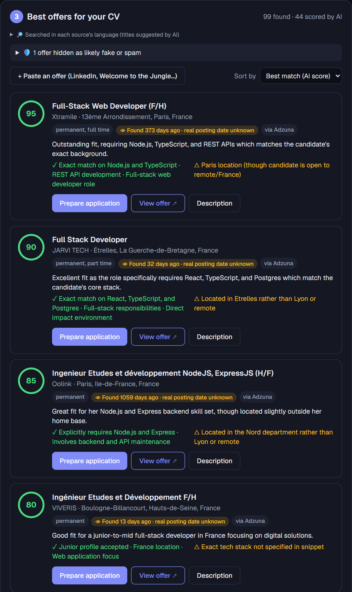
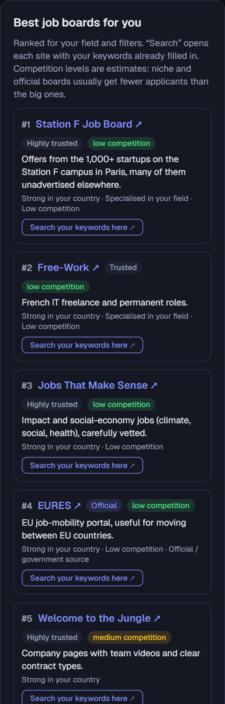
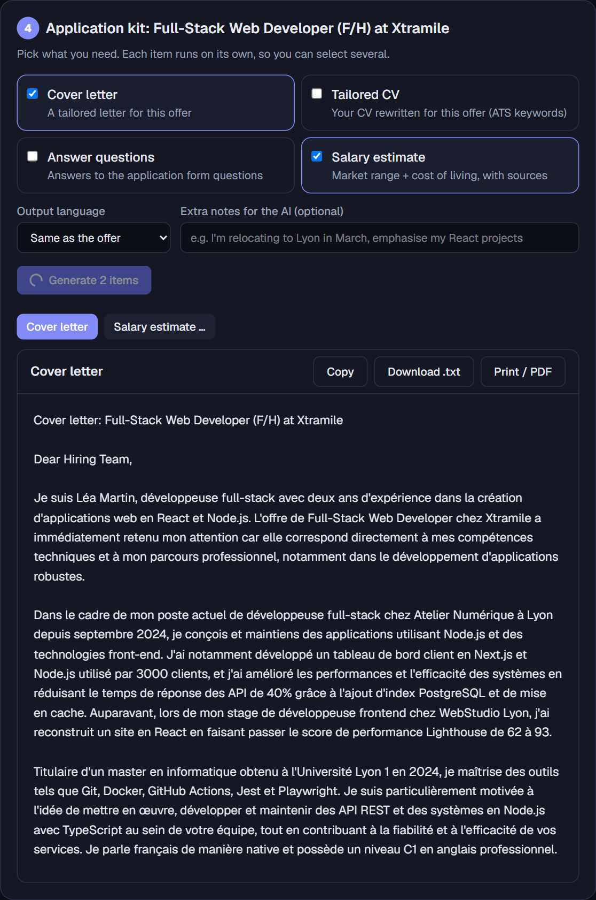
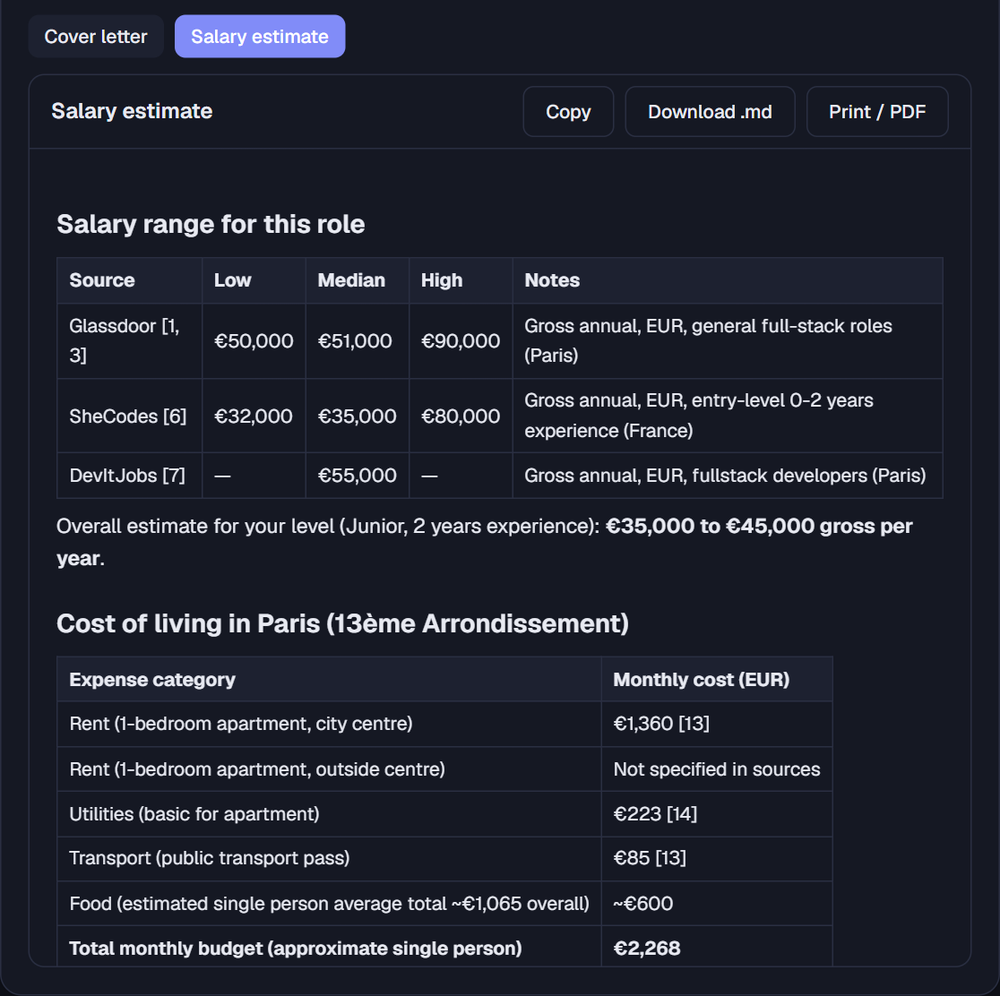
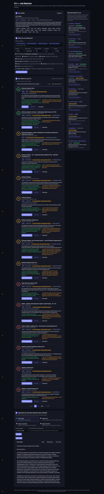
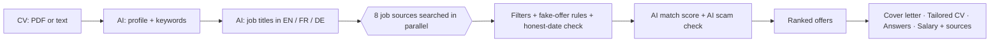

<div align="center">


# JobLens

**Your AI job-search co-pilot.** Upload your CV, get the real job offers that fit you best across Europe,
then generate a tailored cover letter, a rewritten CV, answers to application questions and a sourced salary estimate.

[](https://github.com/aziztarous1999/joblens/actions/workflows/ci.yml)


[](https://joblens-app.vercel.app)

**[▶ Live demo](https://joblens-app.vercel.app)** · [Features](#features) · [How it works](#how-it-works) · [Run it locally](#run-it-locally) · [Deploy](#deploy-to-vercel)

</div>

---



<a id="why"></a>
<details open>
<summary><h2>💡 Why</h2></summary>


Job hunting means checking a dozen boards, rewriting the same cover letter, and guessing whether an offer is real,
recent and fairly paid. JobLens does the boring part: it reads your CV, searches official and public job sources in
the right language, scores every offer against your profile, hides fake ones, and drafts your application, without
inventing anything that isn't in your CV.


</details>

<a id="features"></a>
<details open>
<summary><h2>✨ Features</h2></summary>


<details open>
<summary><b>🔎 Find the right offers</b></summary>

- **CV analysis**: upload a PDF, `.txt` / `.md` or paste your CV. The AI extracts your skills, seniority, languages and search keywords.
- **8 job sources in one search**:
  - **France Travail** and **Bundesagentur für Arbeit**: the official French and German public employment services, with no monthly quota;
  - **Adzuna**: on-site and hybrid offers in 16 countries;
  - **LinkedIn / Indeed / Glassdoor** through JSearch (Google for Jobs data);
  - **Remotive, Himalayas, Jobicy, Arbeitnow**: remote and European boards.
- **Multilingual search**: the AI turns your keywords into the job titles employers really use in English, French and German (*Développeur Full Stack*, *Ingénieur études et développement*, *Softwareentwickler*…). Each source is then searched in its own language.
- **Filters**:
  - country;
  - on-site / hybrid / remote;
  - contract (CDI, CDD, freelance, internship, apprenticeship);
  - full- or part-time;
  - posted in the last 1 h / 2 h / 6 h / 24 h / 3 days;
  - offers with **relocation or visa support** only.
- **AI match score (0–100)** for every top offer, with strengths ✓ and gaps △. Sort by best match or newest, 15 offers per page.
- **Focused layout**: every section collapses with a click, and the job-boards side panel can be hidden (☰) to give the offers the full width. Your choices are remembered.




</details>

<details open>
<summary><b>🛡️ Trustworthy results</b></summary>

- **Fake-offer filter**: rule-based checks flag:
  - pay-to-apply schemes and WhatsApp/Telegram hiring;
  - unrealistic earnings, parcel reshipping and investment scams;
  - aggregator spam and template spam.

  An AI check also runs while scoring. Hidden offers are listed with the reason, so nothing disappears silently.
- **Honest dates**: sources that only know when an offer was *indexed* (Google for Jobs, Adzuna) show **"Found … · real posting date unknown"**, and they are excluded from the "posted within" filters.
- **Duplicates merged**: the same offer re-posted by aggregators appears once.


</details>

<details open>
<summary><b>🧭 Where to apply</b></summary>

- **Best job boards for you**: about 40 curated boards, ranked for your field, country, contract and work mode, with trust level and estimated competition. They include Welcome to the Jungle, the Station F job board, APEC, EURES, StepStone and Jobs That Make Sense. One click opens each site's search with your keywords already filled in.

<p align="center"></p>


</details>

<details open>
<summary><b>✉️ Apply faster</b></summary>

Pick any offer and generate what you need:
- **Cover letter**: 250–350 words in plain text, starting with *you*, highlighting your strongest truthful matches. It never mentions gaps and never uses em dashes.
- **Tailored CV**: rewritten for the offer, with ATS keywords that are actually in your CV, plus a *"What I changed"* summary.
- **Answers to application questions**: paste the form questions and get first-person drafts.
- **Salary estimate**: market range plus cost of living in the job's city, from a live web search, **with numbered sources**. It prefers Glassdoor, Levels.fyi, APEC, INSEE/ONS/BLS and Numbeo.
- **Output in English, French, German or Spanish**, or the offer's language. Copy, download, or print / save as PDF.





</details>

<details open>
<summary><b>💸 Runs for free</b></summary>

- **Google Gemini free tier** by default, falling back to the next model when one is overloaded.
- **Optional local AI with Ollama**: no key, no quota, and your CV never leaves your PC. `npm install` downloads a portable Ollama into the project, and `npm run dev` starts it. It takes over automatically when Gemini is busy.
- **Claude** is supported as an optional paid provider.

<details>
<summary><b>📸 A real run with my own CV</b> (full page)</summary>



</details>


</details>


</details>

<a id="how-it-works"></a>
<details open>
<summary><h2>⚙️ How it works</h2></summary>




- **Swappable AI providers** behind one interface (`src/lib/ai/`): Gemini (default), Ollama (local) and Claude. All use JSON-schema structured output and streaming. The fallback chain covers overloaded or rate-limited models.
- **Grounded salary research**: Tavily web search results go to the model, and every figure is cited `[n]`. Without a search key, the answer is clearly labelled as an estimate, with links to check it.
- **No scraping**: only official or public APIs. Sites without an API (Welcome to the Jungle, Station F) get a pre-filled search link instead.


</details>

<a id="tech-stack"></a>
<details open>
<summary><h2>🧰 Tech stack</h2></summary>


| | |
|---|---|
| App | **Next.js 16** (App Router, Route Handlers, streaming), **React 19**, **TypeScript**, **Tailwind CSS 4** |
| AI | `@google/genai` (Gemini), `ollama` + portable Ollama runtime, `@anthropic-ai/sdk` (Claude), `zod` schemas, `unpdf` |
| Data | France Travail, Bundesagentur für Arbeit, Adzuna, JSearch (RapidAPI), Remotive, Himalayas, Jobicy, Arbeitnow, Tavily |
| Tooling | ESLint, GitHub Actions CI, Vercel |

```
src/
├─ app/
│  ├─ page.tsx                # the 4-step UI
│  ├─ icon.svg                # app icon / favicon
│  └─ api/
│     ├─ profile/route.ts     # CV → structured profile
│     ├─ jobs/route.ts        # search terms → sources → filters → AI scoring
│     ├─ generate/route.ts    # cover letter / tailored CV / answers (streaming)
│     └─ salary/route.ts      # salary + cost of living, with sources
├─ components/                # CvStep, FiltersPanel, JobList, JobSites, Workspace, ui
└─ lib/
   ├─ ai/                     # provider interface: gemini.ts, ollama.ts, claude.ts, search.ts
   ├─ jobs.ts                 # job sources, filters, dates
   ├─ officialJobs.ts         # France Travail + Bundesagentur
   ├─ searchTerms.ts          # AI job-title expansion per language
   ├─ quality.ts              # fake / spam offer filter
   └─ jobSites.ts             # curated job boards + ranking
scripts/
├─ dev.mjs                    # starts Ollama (optional) + Next.js
└─ ollama.mjs                 # downloads / runs the project-local Ollama
```


</details>

<a id="run-it-locally"></a>
<details open>
<summary><h2>💻 Run it locally</h2></summary>


**Requirements:** Node.js 20+ (tested with 24) and a free Gemini API key.

```bash
git clone https://github.com/aziztarous1999/joblens.git
cd joblens
cp .env.example .env.local      # then fill in your keys (see below)
npm install
npm run dev                     # http://localhost:3000 (or set PORT in .env.local)
```

Try it with the fictional CV in [`docs/sample-cv.md`](docs/sample-cv.md).

<details open>
<summary><b>API keys (all free)</b></summary>


| Variable | Needed for | Get it |
|---|---|---|
| `GEMINI_API_KEY` | **Required**: the AI | https://aistudio.google.com/apikey (no card) |
| `TAVILY_API_KEY` | Sourced salary research | https://app.tavily.com (1,000 searches/month) |
| `ADZUNA_APP_ID`, `ADZUNA_APP_KEY` | On-site offers in 16 countries | https://developer.adzuna.com |
| `FRANCE_TRAVAIL_CLIENT_ID`, `_SECRET` | All French offers, no monthly cap | https://francetravail.io → create an app → subscribe to *Offres d'emploi* |
| `RAPIDAPI_KEY` | LinkedIn / Indeed / Glassdoor offers | [JSearch](https://rapidapi.com/letscrape-6bRBa3QguO5/api/jsearch), free Basic plan (~100 requests/month) |
| `AI_FALLBACK=ollama` | Free local AI when Gemini is busy | nothing to get: `npm install` downloads it (Windows x64) |
| `AI_PROVIDER=claude` + `ANTHROPIC_API_KEY` | Optional paid provider | https://platform.claude.com/settings/keys |

Bundesagentur, Remotive, Himalayas, Jobicy and Arbeitnow need no key.


</details>

<details open>
<summary><b>Scripts</b></summary>


| Command | What it does |
|---|---|
| `npm run dev` | Starts the local Ollama (if enabled), pulls the model on first run, then Next.js |
| `npm run dev:next` | Next.js only |
| `npm run build` / `npm start` | Production build / server |
| `npm run lint` | ESLint |
| `npm run ollama:install` / `ollama:pull` | Download the portable Ollama / the model (`qwen3:4b` by default) |


</details>


</details>

<a id="deploy-to-vercel"></a>
<details open>
<summary><h2>🚀 Deploy to Vercel</h2></summary>


1. Import the GitHub repo on [vercel.com/new](https://vercel.com/new). The framework is detected automatically.
2. Add the environment variables: `GEMINI_API_KEY` at minimum, plus `TAVILY_API_KEY` and `ADZUNA_*`, and **`RATE_LIMIT_PER_HOUR=20`** so one visitor can't use up your free quotas (a search or salary estimate counts as 2 actions). Do **not** set `AI_FALLBACK=ollama`, because Ollama runs on your own PC, not on Vercel. The Ollama download is skipped automatically on Vercel.
3. Deploy. Every push to `main` redeploys, and pull requests get preview URLs. CI (lint, type-check, build) runs on GitHub Actions.

> A public demo uses your free quotas. Leave `RAPIDAPI_KEY` unset on the demo to keep your ~100 monthly JSearch requests for yourself.


</details>

<a id="live-demo"></a>
<details open>
<summary><h2>🔗 Live demo</h2></summary>


**👉 [https://joblens-app.vercel.app](https://joblens-app.vercel.app)**, hosted on Vercel and redeployed on every push to `main`.

Try it with the fictional CV in [`docs/sample-cv.md`](docs/sample-cv.md): paste it in step 1, then click **Find my best matches**.

To keep the free API quotas available for everyone, the demo allows **20 AI actions per hour per visitor**, and LinkedIn / Indeed results (JSearch) are disabled. [Run it locally](#run-it-locally) for unlimited use.


</details>

<a id="notes--limits"></a>
<details open>
<summary><h2>📝 Notes & limits</h2></summary>


- **Your CV is sent only to the AI provider you configure.** With Ollama it never leaves your computer. On Gemini's free tier, Google may use prompts to improve its products. The parsed profile is stored in your browser's `localStorage` only.
- **Generated documents use only facts from your CV**, but always proofread before sending.
- **Job-board competition levels are editorial estimates.** Bundesagentur's list API has no description text, so its AI scores rely on title and conditions.
- **Offers keep their original links**, and each source is credited, as their terms ask.


</details>

<a id="license"></a>
<details open>
<summary><h2>📄 License</h2></summary>


[MIT](LICENSE) © 2026 Aziz Tarous


</details>
